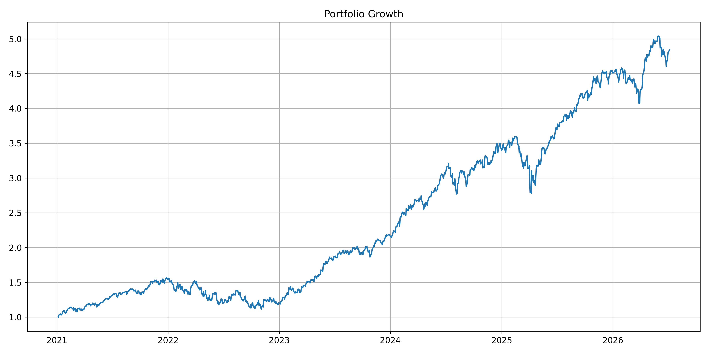
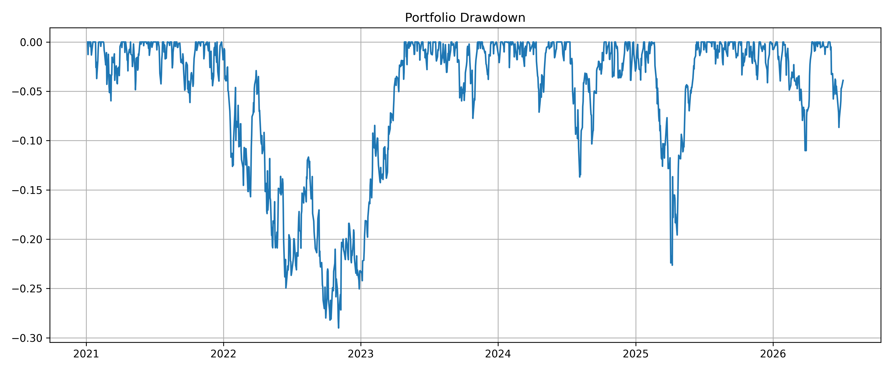
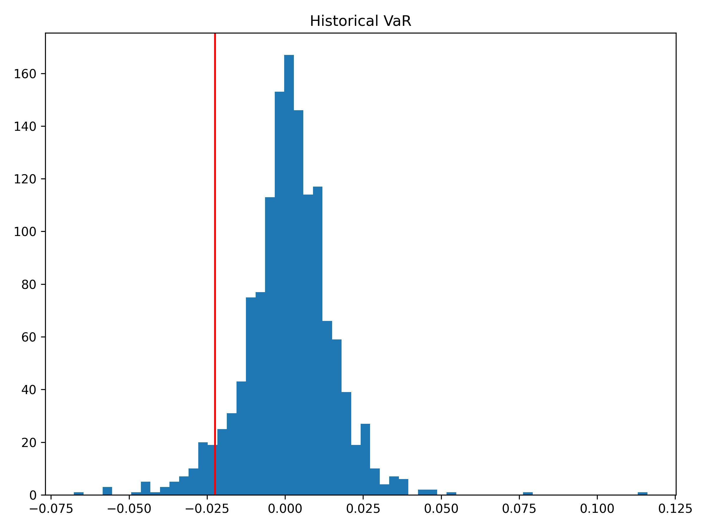
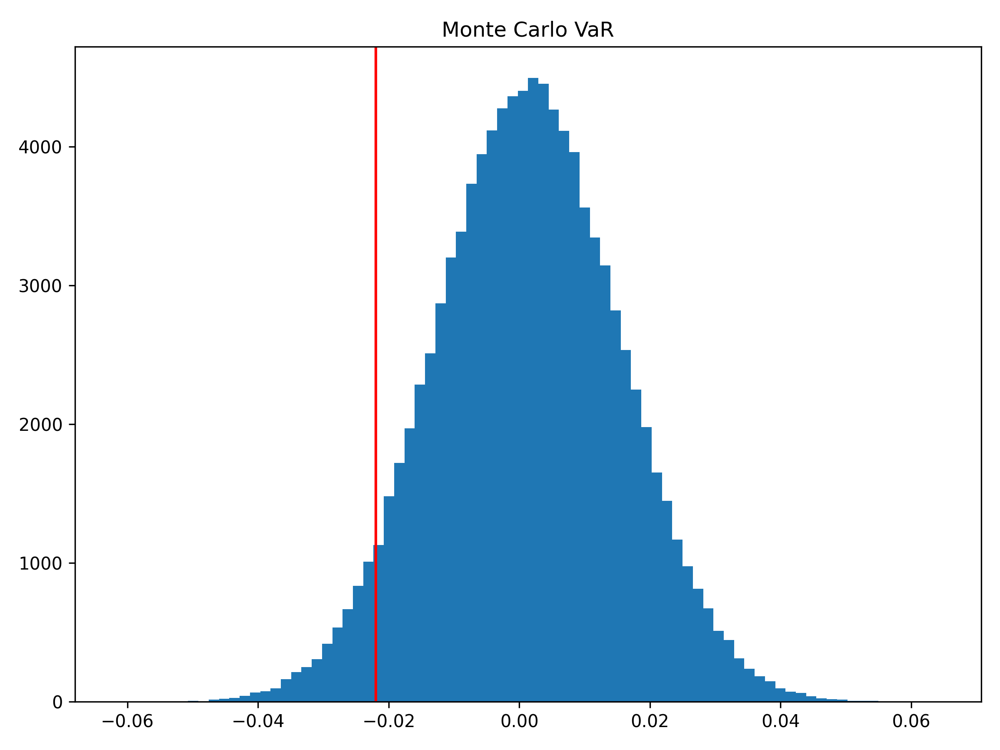
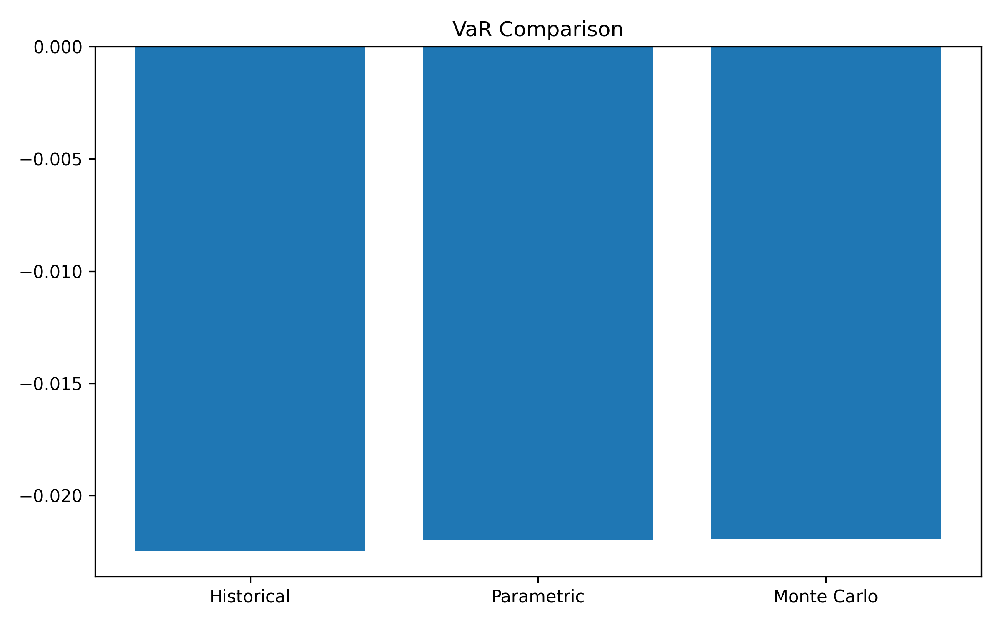

# Value-at-Risk (VaR) & Risk Analytics Dashboard

A quantitative finance project implementing multiple Value-at-Risk (VaR) methodologies to measure portfolio risk and estimate potential losses under normal market conditions.

The dashboard combines historical analysis, statistical modeling, Monte Carlo simulation, and portfolio analytics to provide a comprehensive view of market risk.

## Overview

This project develops a professional risk management framework capable of:

* Downloading and cleaning historical market data
* Building an equal-weight portfolio
* Engineering portfolio risk features
* Calculating Historical Value-at-Risk (VaR)
* Calculating Parametric (Variance-Covariance) VaR
* Calculating Monte Carlo VaR
* Computing Conditional Value-at-Risk (CVaR)
* Measuring portfolio performance
* Visualizing portfolio risk
* Exporting risk analytics

The notebook demonstrates the quantitative techniques widely used by banks, hedge funds, asset managers, and risk management teams.

## Features

### Market Data Pipeline

* Historical market data from Yahoo Finance
* Automatic data cleaning
* Missing value handling
* Equal-weight portfolio construction

### Feature Engineering

The notebook computes:

* Daily Portfolio Returns
* Cumulative Portfolio Returns
* Annual Return
* Annual Volatility
* Rolling Volatility
* Rolling Sharpe Ratio
* Portfolio Drawdown

### Historical Value-at-Risk

Measures potential portfolio loss using the empirical distribution of historical returns.

Outputs:

* Historical VaR
* Historical Expected Shortfall (CVaR)

### Parametric Value-at-Risk

Implements the Variance-Covariance approach assuming normally distributed returns.

Outputs:

* Parametric VaR
* Parametric Expected Shortfall

### Monte Carlo Simulation

Generates thousands of simulated portfolio returns using a stochastic model.

Outputs:

* Monte Carlo VaR
* Monte Carlo Expected Shortfall
* Simulated Return Distribution

## Performance Metrics

Portfolio analytics include:

* Annual Return
* Annual Volatility
* Historical VaR
* Parametric VaR
* Monte Carlo VaR
* Historical CVaR
* Parametric CVaR
* Monte Carlo CVaR
* Rolling Volatility
* Rolling Sharpe Ratio
* Maximum Drawdown

## Visualizations

The notebook generates:

* Historical Asset Prices
* Historical Return Distribution
* Parametric VaR Distribution
* Monte Carlo Return Distribution
* Portfolio Growth Curve
* Portfolio Drawdown
* Rolling Volatility
* Rolling Sharpe Ratio
* VaR Comparison Dashboard
* CVaR Comparison Dashboard

## Technologies

**Programming**

* Python

**Libraries**

* NumPy
* Pandas
* SciPy
* Plotly
* Matplotlib
* yFinance

## Project Structure

```text
value-at-risk-dashboard/

├── value_at_risk_dashboard.ipynb
├── README.md
├── requirements.txt
├── outputs/
│   ├── historical_var.csv
│   ├── parametric_var.csv
│   ├── monte_carlo_var.csv
│   ├── risk_statistics.csv
│   └── var_comparison.csv
├── screenshots/
│   ├── portfolio_growth.png
│   ├── portfolio_drawdown.png
│   ├── historical_var.png
│   ├── monte_carlo_var.png
│   └── var_comparison.png
└── LICENSE
```

## Results

### Portfolio Growth



### Portfolio Drawdown



### Historical Value-at-Risk



### Monte Carlo Value-at-Risk



### VaR Comparison



## Skills Demonstrated

### Quantitative Finance

* Market Risk Management
* Value-at-Risk Modeling
* Conditional Value-at-Risk
* Monte Carlo Simulation
* Statistical Risk Analysis
* Portfolio Analytics

### Data Science

* Feature Engineering
* Financial Data Processing
* Statistical Modeling
* Data Visualization

### Programming

* Python Development
* Scientific Computing
* Financial Modeling
* Risk Analytics

## Future Enhancements

* Portfolio Stress Testing
* Historical Crisis Replay (2008, COVID-19)
* GARCH Volatility Forecasting
* Extreme Value Theory (EVT)
* Cornish-Fisher VaR
* Multi-Asset Portfolio Support
* Interactive Dash Dashboard
* Real-Time Risk Monitoring
* Scenario Analysis
* Risk Attribution

## Disclaimer

This project is intended for educational and research purposes only and should not be considered financial or investment advice.

## Author

**Zander Felder**

Independent Quantitative Finance & Data Science Projects

